# Database Design Agent Project

This project aims to build and improve an AI agent that reads a business requirement and generates database design artifacts, from requirement analysis to SQL query design.

## 1. Getting Started with OpenCode

**OpenCode Installation Guide:** [https://opencode.ai/docs/](https://opencode.ai/docs/)

After installation, open the project folder in your terminal and start OpenCode:

```bash
cd path/to/your/project
opencode
```

### Connect OpenCode to an LLM Model

You must connect OpenCode to at least one LLM provider before running the database design agent.
*   **Provider guide:** [https://opencode.ai/docs/providers/](https://opencode.ai/docs/providers/)
*   **Model guide:** [https://opencode.ai/docs/models/](https://opencode.ai/docs/models/)

Inside the OpenCode terminal, run the following commands:

1.  **Connect Provider:** Run `/connect` and select your preferred LLM provider (e.g., OpenAI, Anthropic, Gemini, OpenRouter).
2.  **Select Model:** Run `/models` and choose the specific model you want to use for the project.

---

## 2. Project Structure

The Git repository includes the following files and folders. You can adapt it as needed:

```text
.
├── .opencode/
│   ├── commands/
│   │   └── design-db.md               
│   └── skills/
│       └── db-design-pipeline/
│           ├── templates/               
│           └── SKILL.md                 
├── req/
│   ├── business-requirement.md          
│   └── summary-business-requirement.md  
├── outputs/                             
├── AGENTS.md                            
├── README.md                         
└── .gitignore
```

---

## 3. Project Architecture

```mermaid
flowchart LR

%%================ INPUT =====================
subgraph Input["Input Preparation"]
    A["business-requirement.md"]
    G["LLM (e.g., Gemini Pro)"]
    B["summary-business-requirement.md"]

    A --> G --> B
end

%%================ AI =====================
subgraph AI["AI Database Design Agent"]
    C["OpenCode"]
    D["Selected LLM Model"]

    C <--> D
end

%%================ OUTPUT =====================
subgraph Pipeline["Database Design Pipeline"]
    E1["Business Requirement Analysis"]
    E2["Conceptual ERD"]
    E3["Logical Database Design"]
    E4["Design Validation"]
    E5["SQL DDL"]
    E6["Sample Data"]
    E7["SQL Query Design"]

    E1 --> E2 --> E3 --> E4 --> E5 --> E6 --> E7
end

%%================ DATABASE =====================
subgraph Validation["Database Validation"]
    SQL["Microsoft SQL Server"]
end

A --> C
B --> C
D --> E1
E5 --> SQL
E6 --> SQL
E7 --> SQL
```


---

## 4. Main Files and Folders

| File / Folder | Purpose |
|---|---|
| `.opencode/` | Stores OpenCode commands, skills, and related configurations. |
| `.opencode/commands/design-db.md` | Defines the custom command used to trigger the database design pipeline. |
| `.opencode/skills/db-design-pipeline/SKILL.md` | Defines the agent workflow, rules, design steps, and output requirements. |
| `.opencode/skills/db-design-pipeline/templates/` | Stores templates used by the agent to generate consistent outputs. |
| `req/business-requirement.md` | Contains the original input business requirement. |
| `req/summary-business-requirement.md`| Contains the structured summary of the business requirement used as a strict checklist. |
| `outputs/` | Stores all generated project artifacts (Markdown files & SQL scripts). |
| `AGENTS.md` | Contains project-level instructions and personas for the agent. |
| `README.md` | Explains how to install, run, and evaluate the project. |
| `.gitignore` | Excludes private or unnecessary files from Git. |

---

## 5. How to Run the Agent

To ensure high-quality outputs, **the agent is configured to work step-by-step**. The execution is controlled by updating the instruction block inside the command file.

**Step 1: Execute Task 1**
By default, the `.opencode/commands/design-db.md` file is configured to run only Step 1. Run the custom command in the OpenCode terminal:
```text
/design-db req/business-requirement.md
```
*The agent will analyze the requirements and generate `outputs/01-business-req-analysis.md`.*

**Step 2: Proceed Iteratively to Next Steps**
Once a step is completed and reviewed, you move to the next step by updating the command configuration:

1. Open `.opencode/commands/design-db.md`.
2. Locate the `INSTRUCTIONS:` section at the bottom of the file.
3. Update the text to target the next step. For example, to run Step 2, change it to:
   ```markdown
   INSTRUCTIONS:
   1. We will work step-by-step. Do NOT execute all steps at once.
   2. For now, ONLY execute Step 2: Conceptual Design / ERD based on the file outputs/01-business-req-analysis.md, then stop reporting and wait for my approval before proceeding to the next step.
   ```
4. Save the file and **re-run the exact same command** in the terminal:
   ```text
   /design-db req/business-requirement.md
   ```

Repeat this iterative process until all 7 steps are successfully completed.