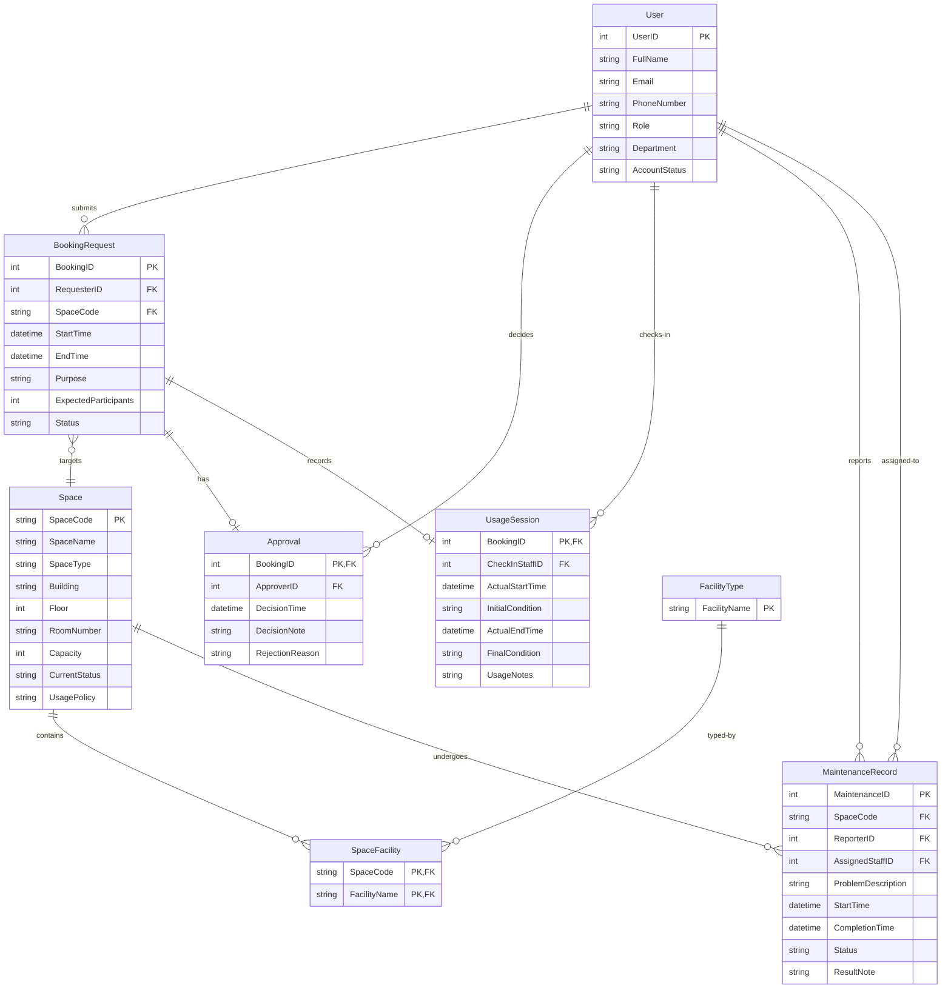

# 02 — Conceptual Design (ERD)

## 1. Entity-Relationship Diagram

---

## 2. Relationships Detail

### 2.1. User — BookingRequest ("submits")
- **Cardinality:** 1:N (one user may submit many booking requests; each booking request belongs to exactly one user).
- **Participation:** User (optional) — not every user needs a booking; BookingRequest (mandatory).
- **FK:** `BookingRequest.RequesterID` → `User.UserID`

### 2.2. BookingRequest — Space ("targets")
- **Cardinality:** N:1 (many booking requests may target the same space; each booking request targets exactly one space).
- **Participation:** BookingRequest (mandatory); Space (optional) — a space may have zero bookings.
- **FK:** `BookingRequest.SpaceCode` → `Space.SpaceCode`

### 2.3. BookingRequest — Approval ("has")
- **Cardinality:** 1:1 (each booking request has at most one approval record; each approval record belongs to exactly one booking request).
- **Participation:** Approval (mandatory — when a decision is made, a record is created); BookingRequest (optional — not all bookings require approval / decision may be pending).
- **FK:** `Approval.BookingID` → `BookingRequest.BookingID`
- **Role-Based Access:** Only users with roles `FacilityStaff` or `FacilityManager` may act as the approver (`Approval.ApproverID`).

### 2.4. User — Approval ("decides")
- **Cardinality:** 1:N (one user may approve/reject many bookings; each approval record has exactly one approver).
- **Participation:** User (optional); Approval (mandatory).
- **FK:** `Approval.ApproverID` → `User.UserID`

### 2.5. BookingRequest — UsageSession ("records")
- **Cardinality:** 1:1 (each booking request that is checked in produces at most one usage session; each usage session belongs to exactly one booking).
- **Participation:** UsageSession (mandatory when check-in occurs); BookingRequest (optional — booking may be cancelled/rejected before check-in).
- **FK:** `UsageSession.BookingID` → `BookingRequest.BookingID`

### 2.6. User — UsageSession ("checks-in")
- **Cardinality:** 1:N (one staff member may check in many bookings; each usage session has exactly one check-in staff).
- **Participation:** User (optional); UsageSession (mandatory).
- **FK:** `UsageSession.CheckInStaffID` → `User.UserID`
- **Role-Based Access:** Only users with roles `FacilityStaff` or `FacilityManager` may act as check-in staff.

### 2.7. Space — SpaceFacility ("contains")
- **Cardinality:** 1:N (one space may have many facility assignments; each assignment belongs to one space).
- **Participation:** Space (optional); SpaceFacility (mandatory).
- **FK:** `SpaceFacility.SpaceCode` → `Space.SpaceCode`

### 2.8. FacilityType — SpaceFacility ("typed-by")
- **Cardinality:** 1:N (one facility type may appear in many space assignments; each assignment references one facility type).
- **Participation:** FacilityType (optional); SpaceFacility (mandatory).
- **FK:** `SpaceFacility.FacilityName` → `FacilityType.FacilityName`

### 2.9. User — MaintenanceRecord ("reports")
- **Cardinality:** 1:N (one user may report many maintenance issues; each maintenance record has exactly one reporter).
- **Participation:** User (optional); MaintenanceRecord (mandatory).
- **FK:** `MaintenanceRecord.ReporterID` → `User.UserID`

### 2.10. User — MaintenanceRecord ("assigned-to")
- **Cardinality:** 1:N (one staff member may be assigned many maintenance tasks; each maintenance record may be assigned to at most one staff member).
- **Participation:** User (optional); MaintenanceRecord (optional — a record may be unassigned).
- **FK:** `MaintenanceRecord.AssignedStaffID` → `User.UserID`
- **Role-Based Access:** Only users with roles `FacilityStaff` or `FacilityManager` may be assigned as the responsible staff member.

### 2.11. Space — MaintenanceRecord ("undergoes")
- **Cardinality:** 1:N (one space may have many maintenance records; each maintenance record is for exactly one space).
- **Participation:** Space (optional); MaintenanceRecord (mandatory).
- **FK:** `MaintenanceRecord.SpaceCode` → `Space.SpaceCode`

---

## 3. Role-Based Access Summary

| Action | Allowed Roles |
|--------|--------------|
| Submit a booking request | Student, Lecturer, TeachingAssistant, DepartmentAdministrator |
| Approve / reject bookings | FacilityStaff, FacilityManager |
| Check-in / check-out bookings | FacilityStaff, FacilityManager |
| Report maintenance | All roles |
| Be assigned to maintenance | FacilityStaff, FacilityManager |
| View reports / history | FacilityStaff, DepartmentAdministrator, FacilityManager |

---

## 4. Design Decisions

| Decision | Rationale |
|----------|-----------|
| Approval as a separate entity (1:1) with BookingID as PK | The relationship has its own attributes (decision time, note, rejection reason). Per modeling rules, relationship attributes should not be folded into one of the participating entity tables. |
| UsageSession as a separate entity (1:1) with BookingID as PK | Same rationale — check-in/out has its own attributes. |
| SpaceFacility as a junction table | Space-to-FacilityType is M:N. The junction table has no extra attributes but is required per modeling rules for M:N relationships. |
| No surrogate key for Approval / UsageSession | Per modeling rules: for 1:1 relationships, use the parent PK as the child PK. |
| Separate FacilityType entity | Ensures facility names are consistent and controlled via a lookup table rather than free-text. |
