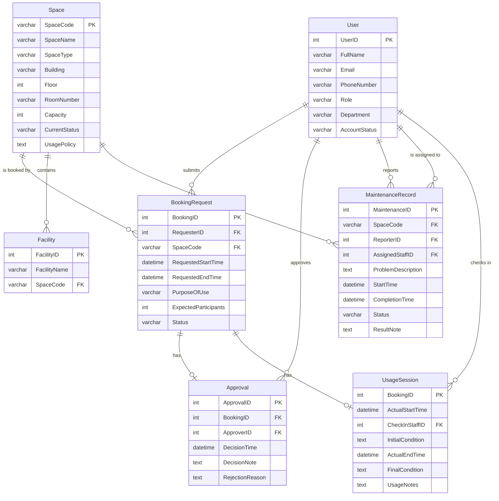

# 02 — Conceptual Database Design (ERD)

## 1. Entities & Attributes

### 1.1. User

| Attribute | Type | PK | Notes |
|-----------|------|----|-------|
| UserID | INT | PK | University account ID |
| FullName | VARCHAR(100) | | |
| Email | VARCHAR(100) | | |
| PhoneNumber | VARCHAR(20) | | |
| Role | VARCHAR(30) | | Student, Lecturer, TA, Facility Staff, Dept Admin, Facility Manager |
| Department | VARCHAR(100) | | |
| AccountStatus | VARCHAR(20) | | Active, Inactive, Suspended |

### 1.2. Space

| Attribute | Type | PK | Notes |
|-----------|------|----|-------|
| SpaceCode | VARCHAR(20) | PK | Unique identifier |
| SpaceName | VARCHAR(100) | | |
| SpaceType | VARCHAR(30) | | Auditorium, Classroom, Computer Lab, Project Lab, Meeting Room, Student Workspace |
| Building | VARCHAR(50) | | |
| Floor | INT | | |
| RoomNumber | VARCHAR(20) | | |
| Capacity | INT | | |
| CurrentStatus | VARCHAR(20) | | Available, In Use, Under Maintenance, Temporarily Closed, Retired |
| UsagePolicy | TEXT | | |

### 1.3. Facility

| Attribute | Type | PK | Notes |
|-----------|------|----|-------|
| FacilityID | INT | PK | |
| FacilityName | VARCHAR(50) | | Projector, Whiteboard, Microphone, Computer, etc. |
| SpaceCode | VARCHAR(20) | FK | References Space |

### 1.4. BookingRequest

| Attribute | Type | PK | Notes |
|-----------|------|----|-------|
| BookingID | INT | PK | |
| RequesterID | INT | FK | References User |
| SpaceCode | VARCHAR(20) | FK | References Space |
| RequestedStartTime | DATETIME | | |
| RequestedEndTime | DATETIME | | |
| PurposeOfUse | VARCHAR(30) | | Lecture, Examination, Seminar, Workshop, Meeting, Student Activity, Administrative Event |
| ExpectedParticipants | INT | | |
| Status | VARCHAR(20) | | Pending, Approved, Rejected, Cancelled, Checked In, Completed, No-show |

### 1.5. Approval

| Attribute | Type | PK | Notes |
|-----------|------|----|-------|
| ApprovalID | INT | PK | |
| BookingID | INT | FK | References BookingRequest (unique) |
| ApproverID | INT | FK | References User |
| DecisionTime | DATETIME | | |
| DecisionNote | TEXT | | |
| RejectionReason | TEXT | | Required only when Rejected |

### 1.6. UsageSession

| Attribute | Type | PK | Notes |
|-----------|------|----|-------|
| BookingID | INT | PK, FK | References BookingRequest |
| ActualStartTime | DATETIME | | |
| CheckInStaffID | INT | FK | References User |
| InitialCondition | TEXT | | |
| ActualEndTime | DATETIME | | |
| FinalCondition | TEXT | | |
| UsageNotes | TEXT | | |

### 1.7. MaintenanceRecord

| Attribute | Type | PK | Notes |
|-----------|------|----|-------|
| MaintenanceID | INT | PK | |
| SpaceCode | VARCHAR(20) | FK | References Space |
| ReporterID | INT | FK | References User |
| AssignedStaffID | INT | FK | References User |
| ProblemDescription | TEXT | | |
| StartTime | DATETIME | | |
| CompletionTime | DATETIME | | Nullable |
| Status | VARCHAR(20) | | Reported, In Progress, Completed, Cancelled |
| ResultNote | TEXT | | |

---

## 2. Entity-Relationship Diagram (ERD)

---

## 3. Relationship Details

| # | Left Entity | Left Cardinality | Relationship | Right Cardinality | Right Entity | Left Part. | Right Part. |
|---|-------------|:-:|:-:|:-:|-------------|:-:|:-:|
| R1 | User | 1 | submits | N | BookingRequest | Optional | Mandatory |
| R2 | Space | 1 | is booked by | N | BookingRequest | Optional | Mandatory |
| R3 | BookingRequest | 1 | has | 1 | Approval | Optional | Mandatory |
| R4 | User | 1 | approves | N | Approval | Optional | Mandatory |
| R5 | Space | 1 | contains | N | Facility | Optional | Mandatory |
| R6 | Space | 1 | has | N | MaintenanceRecord | Optional | Mandatory |
| R7 | User | 1 | reports | N | MaintenanceRecord | Optional | Mandatory |
| R8 | User | 1 | is assigned to | N | MaintenanceRecord | Optional | Optional |
| R9 | User | 1 | checks in | N | UsageSession | Optional | Mandatory |
| R10 | BookingRequest | 1 | has | 1 | UsageSession | Optional | Mandatory |

### Participation Explanation

- **R1 — User submits BookingRequest:** A User may submit zero or many bookings (optional). Every BookingRequest must belong to exactly one User (mandatory).
- **R2 — Space is booked by BookingRequest:** A Space may have zero or many bookings (optional). Every BookingRequest must reference exactly one Space (mandatory).
- **R3 — BookingRequest has Approval:** A BookingRequest may have at most one Approval (optional — e.g., pending bookings have none). Every Approval must correspond to exactly one BookingRequest (mandatory).
- **R4 — User approves Approval:** A User (with Facility Staff or Manager role) may approve/reject zero or many bookings (optional). Every Approval must have exactly one Approver (mandatory).
- **R5 — Space contains Facility:** A Space may have zero or many Facilities (optional). Every Facility must belong to exactly one Space (mandatory).
- **R6 — Space has MaintenanceRecord:** A Space may have zero or many maintenance records (optional). Every MaintenanceRecord must reference exactly one Space (mandatory).
- **R7 — User reports MaintenanceRecord:** A User may report zero or many issues (optional). Every MaintenanceRecord must have exactly one Reporter (mandatory).
- **R8 — User is assigned to MaintenanceRecord:** A User (Facility Staff) may be assigned zero or many maintenance tasks (optional). A MaintenanceRecord may have zero or one AssignedStaff (optional — can be unassigned initially).
- **R9 — User checks in UsageSession:** A User (Facility Staff) may check in zero or many bookings (optional). Every UsageSession must record exactly one check-in staff member (mandatory).
- **R10 — BookingRequest has UsageSession:** A BookingRequest may have at most one UsageSession (optional — not yet checked in). Every UsageSession corresponds to exactly one BookingRequest (mandatory).

---

## 4. Business Rule Mapping

| Rule | ERD Enforcement |
|------|----------------|
| BR1 — Unique Booking ID | BookingRequest.BookingID is PK |
| BR2 — No overlapping bookings | Application-enforced (cannot be expressed directly in ERD); noted as a system constraint |
| BR3 — Unavailable space cannot be booked | Application checks Space.CurrentStatus and MaintenanceRecord.Status before allowing booking |
| BR4 — Approval tracking | Approval entity records ApproverID, DecisionTime, DecisionNote, RejectionReason |
| BR5 — Check-in/Check-out recording | UsageSession entity captures all required fields |
| BR6 — Maintenance blocks booking | Application must check active MaintenanceRecord for the Space |
| BR7 — Historical records | Entities preserve data (no deletion); status fields distinguish active vs historical |
| BR8 — University account required | User entity is the anchor; all requesters reference User |
| BR9 — Status lifecycle | BookingRequest.Status attribute tracks the lifecycle state |
