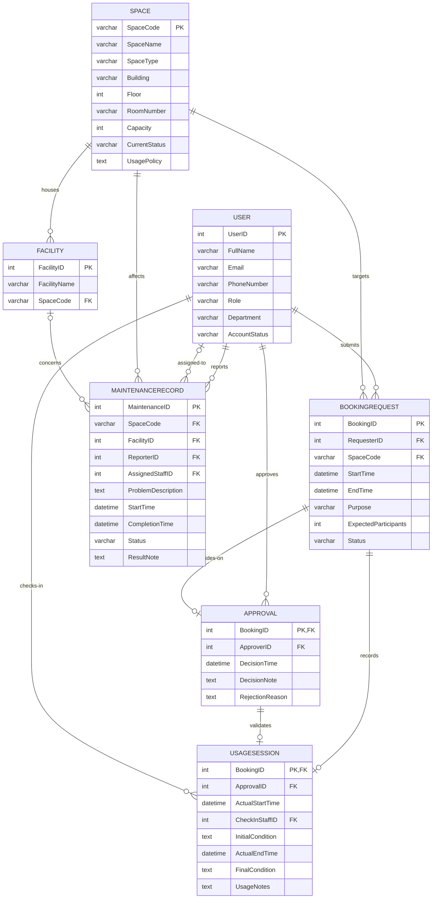

# 02 — Conceptual Database Design (ERD)

Based on `outputs/01-business-req-analysis.md` (Step 1). Entities, attributes, relationships, cardinalities, and participation constraints follow the Step 1 analysis; all relationships are explicitly named and mapped.

---

## 1. Entities Overview

| # | Entity | PK | Key FKs | Notes |
|---|--------|----|---------|-------|
| 1 | User | UserID | — | All actors (student, lecturer, TA, facility staff, department admin, facility manager) |
| 2 | Space | SpaceCode | — | Bookable shared space |
| 3 | Facility | FacilityID | SpaceCode | Individual physical unit (surrogate key, per §1.3) |
| 4 | BookingRequest | BookingID | RequesterID → User, SpaceCode → Space | |
| 5 | Approval | BookingID | ApproverID → User | 1:1 with BookingRequest (parent PK used as child PK) |
| 6 | UsageSession | BookingID | ApprovalID → Approval, CheckInStaffID → User | 1:1 with BookingRequest; also references Approval (§1.6) |
| 7 | MaintenanceRecord | MaintenanceID | SpaceCode → Space, FacilityID → Facility, ReporterID → User, AssignedStaffID → User | |

---

## 2. ERD (Mermaid `erDiagram` — Crow's Foot)

---

## 3. Relationship Details

Legend for cardinality symbols (Crow's Foot):
- `||` — exactly one (mandatory)
- `|o` — zero or one (optional)
- `o{` — zero or more (optional)
- `}|` — one or more (mandatory)

### 3.1. Submits — User → BookingRequest (1:N)
| Property | Value |
|----------|-------|
| Cardinality | 1:N (each BookingRequest has exactly one Requester; each User submits zero or more bookings) |
| Participation | BookingRequest side: mandatory; User side: optional |
| FK placement | `BookingRequest.RequesterID` |
| Role-based access | Only registered users (all roles) may submit bookings. |

### 3.2. Targets — Space → BookingRequest (1:N)
| Property | Value |
|----------|-------|
| Cardinality | 1:N (each BookingRequest targets exactly one Space; each Space may have zero or more bookings) |
| Participation | BookingRequest side: mandatory; Space side: optional |
| FK placement | `BookingRequest.SpaceCode` |
| Role-based access | None. |

### 3.3. Approves — User → Approval (1:N)
| Property | Value |
|----------|-------|
| Cardinality | 1:N (each Approval has exactly one Approver; each User may make zero or more decisions) |
| Participation | Approval side: mandatory; User side: optional |
| FK placement | `Approval.ApproverID` |
| Role-based access | **Approver must be a FacilityStaff or FacilityManager (BR16).** |

### 3.4. Decides-on — Approval ↔ BookingRequest (1:1)
| Property | Value |
|----------|-------|
| Cardinality | 1:1 (each BookingRequest has at most one Approval; each Approval belongs to exactly one BookingRequest) |
| Participation | Approval side: mandatory; BookingRequest side: optional (a pending/cancelled booking may have no decision) |
| PK/FK placement | `Approval.BookingID` = PK + FK → BookingRequest (parent PK reused as child PK — no surrogate key) |
| Attributes carried | DecisionTime, DecisionNote, RejectionReason live on Approval (relationship attributes are NOT folded into BookingRequest) |
| Role-based access | Only FacilityStaff/FacilityManager may create this record (BR16). |

### 3.5. Records — BookingRequest → UsageSession (1:1, check-in/check-out)
| Property | Value |
|----------|-------|
| Cardinality | 1:1 (each BookingRequest has at most one UsageSession; each session belongs to exactly one BookingRequest) |
| Participation | UsageSession side: mandatory; BookingRequest side: optional (only approved, checked-in bookings get a session) |
| PK/FK placement | `UsageSession.BookingID` = PK + FK → BookingRequest (parent PK reused as child PK) |
| Role-based access | Session is created by FacilityStaff at check-in (BR16). |

### 3.6. Validates — Approval → UsageSession (1:1)
| Property | Value |
|----------|-------|
| Cardinality | 1:1 (each UsageSession references exactly one Approval; each Approval may lead to at most one session) |
| Participation | UsageSession side: mandatory (a session may only exist if a valid Approval exists — BR8); Approval side: optional |
| FK placement | `UsageSession.ApprovalID` → Approval |
| Role-based access | None (derived from the approval step). |

### 3.7. Checks-in — User → UsageSession (1:N)
| Property | Value |
|----------|-------|
| Cardinality | 1:N (each UsageSession has exactly one CheckInStaff; each User may check in zero or more sessions) |
| Participation | UsageSession side: mandatory; User side: optional |
| FK placement | `UsageSession.CheckInStaffID` |
| Role-based access | **Check-in staff must be FacilityStaff or FacilityManager (BR16).** |

### 3.8. Houses — Space → Facility (1:N)
| Property | Value |
|----------|-------|
| Cardinality | 1:N (each Facility belongs to exactly one Space; each Space may contain zero or more facilities) |
| Participation | Facility side: mandatory; Space side: optional |
| FK placement | `Facility.SpaceCode` |
| Role-based access | None. |

### 3.9. Reports — User → MaintenanceRecord (1:N)
| Property | Value |
|----------|-------|
| Cardinality | 1:N (each MaintenanceRecord has exactly one Reporter; each User may report zero or more problems) |
| Participation | MaintenanceRecord side: mandatory; User side: optional |
| FK placement | `MaintenanceRecord.ReporterID` |
| Role-based access | Any user role may report (A4). |

### 3.10. Assigned-to — User → MaintenanceRecord (1:N)
| Property | Value |
|----------|-------|
| Cardinality | 1:N (each MaintenanceRecord has zero or one AssignedStaff; each User may be assigned zero or more records) |
| Participation | MaintenanceRecord side: optional (may be unassigned initially); User side: optional |
| FK placement | `MaintenanceRecord.AssignedStaffID` |
| Role-based access | **Assigned staff must be FacilityStaff or FacilityManager (A4 / BR16).** |

### 3.11. Affects — Space → MaintenanceRecord (1:N)
| Property | Value |
|----------|-------|
| Cardinality | 1:N (each MaintenanceRecord concerns exactly one Space; each Space may have zero or more maintenance records) |
| Participation | MaintenanceRecord side: mandatory; Space side: optional |
| FK placement | `MaintenanceRecord.SpaceCode` |
| Role-based access | None. |

### 3.12. Concerns — Facility → MaintenanceRecord (1:N) [Assumption A5]
| Property | Value |
|----------|-------|
| Cardinality | 1:N (each MaintenanceRecord may reference zero or one specific Facility unit; each Facility may appear in zero or more maintenance records) |
| Participation | MaintenanceRecord side: optional; Facility side: optional |
| FK placement | `MaintenanceRecord.FacilityID` |
| Role-based access | None. |
| Status | **Open assumption (Q1)** — §1.3 allows per-unit references, but §1.7 does not list the field explicitly. |

---

## 4. Role-Based Access Constraints

| Constraint | Applies to | Enforcement |
|-----------|-----------|-------------|
| Only FacilityStaff / FacilityManager may approve or reject bookings | Approves (3.3), Decides-on (3.4) | Application-level (BR16) |
| Only FacilityStaff / FacilityManager may check in bookings | Records (3.5), Checks-in (3.7) | Application-level (BR16) |
| Only FacilityStaff / FacilityManager may be assigned maintenance work | Assigned-to (3.10) | Application-level (BR16) |
| Any user role may report a maintenance problem | Reports (3.9) | Application-level |

---

## 5. Modeling-Rule Compliance (per SKILL.md)

| Rule | How it is satisfied |
|------|---------------------|
| Each named relationship must appear explicitly in the schema | All 12 relationships named above map to FK columns or dedicated tables (see Step 3). |
| 1:1 → parent PK reused as child PK, no new surrogate key | `Approval.BookingID` and `UsageSession.BookingID`. |
| Relationship attributes get their own table | Decision info lives in `Approval`; check-in/check-out info lives in `UsageSession`; both are 1:1 relationships with attributes, hence dedicated tables rather than folded into BookingRequest. |
| Plain 1:N with no attributes → FK on child table is enough | Submits, Targets, Approves, Checks-in, Houses, Reports, Assigned-to, Affects, Concerns use FK columns only. |
| M:N relationships | None present in the current requirement set. |

---

## 6. Cross-Check with Step 1

- 7 entities (User, Space, Facility, BookingRequest, Approval, UsageSession, MaintenanceRecord) — all present, none missing.
- All 12 Step-1 relationships reproduced with identical cardinalities and participations.
- BR8 (UsageSession requires valid Approval) enforced structurally via `UsageSession.ApprovalID` FK + mandatory participation.
- BR9 (facilities as individual units) enforced structurally via surrogate `FacilityID` + mandatory `SpaceCode`.
- Role-based rules (BR16) recorded in Section 4 as application-level constraints.
