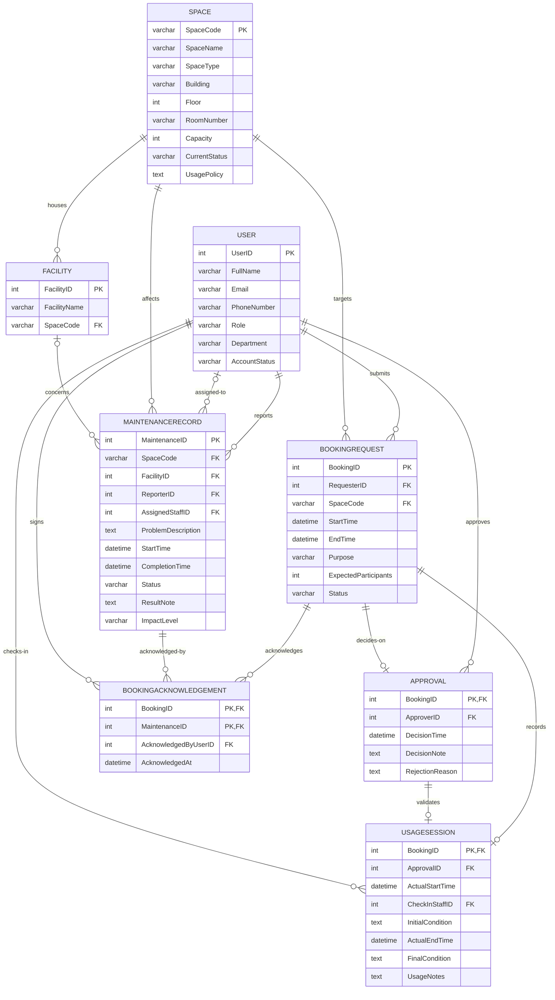

# 09 — Updated ERD & Logical Design (Phase 2)

**Role:** Senior Database Designer
**Basis:** decisions in `outputs/08-requirement-change-analysis-G10.md` applied on top of the Phase 1 ERD (`outputs/02`) and relational schema (`outputs/03`).
**Target DBMS:** Microsoft SQL Server (per AGENTS.md).

**Minimal-changes principle (Step-8 approval):** only the additions approved in Step 8 are applied — the `BookingAcknowledgement` associative entity and the `MaintenanceRecord.ImpactLevel` attribute. All other Phase 1 entities, attributes, relationships, and cardinalities are **unchanged**. Concurrent booking/approval enforcement and the system auto-approval actor are **not** schema changes (they are DB-level locking and a data row, respectively), so they produce no new columns or tables here.

---

## 1. What Changed vs. Phase 1

| # | Change | Kind | Basis (Step 8) |
|----|--------|------|----------------|
| U1 | `MaintenanceRecord.ImpactLevel` (CHECK `Advisory`,`OutOfService`, DEFAULT `OutOfService`) | **[UPDATED]** attribute | D1 (C1) |
| U2 | New associative entity `BookingAcknowledgement` (PK `(BookingID, MaintenanceID)`; M:N resolved into two 1:N identifying relationships) | **[NEW]** entity + relationships | D2 (C1) |
| U3 | Business rules shifted: only open `OutOfService` maintenance blocks overlapping bookings (**BR18**); advisory requires recording acknowledgement per (booking, advisory) (**BR19**) | Behavior | BR18/BR19 (C1) |
| U4 | Overlap invariant guaranteed at DB level (SERIALIZABLE / `UPDLOCK, HOLDLOCK`) — concurrency, no schema change; auto-approval identity via system actor `User` row — data, no schema change | Non-schema | D4, D5 (C4, C5) |

> Only U1 and U2 are structural schema changes. Everything else (escalation query, concurrency strategy, system actor) intentionally leaves the schema untouched.

---

## 2. Updated ERD (Mermaid `erDiagram` — Crow's Foot)

Complete Phase 2 ERD. Entities from Phase 1 are reproduced unmodified so the new additions are visible in context.

---

## 3. New Relationship Details

Legend (Crow's Foot): `||` exactly one (mandatory) · `|o` zero or one (optional) · `o{` zero or more (optional) · `}|` one or more (mandatory).

> Note: cards are drawn on the `BOOKINGACKNOWLEDGEMENT`-side of each relationship. `BookingRecord` is a child of both parents, so each parent-to-child line is **mandatory-parent (||) → optional-many-child (o{)**.

### 3.1. Acknowledges — BookingRequest → BookingAcknowledgement (1:N)
| Property | Value |
|----------|-------|
| Cardinality | 1:N (each `BookingAcknowledgement` belongs to exactly one booking; each booking may acknowledge zero or more advisories) |
| Participation | BookingAcknowledgement side: mandatory; BookingRequest side: optional (only bookings on spaces with active advisories have rows) |
| PK/FK placement | `BookingAcknowledgement.BookingID` = part of composite PK + FK → BookingRequest |
| Role-based access | Acknowledgement row is created at booking time; the recorded owner is the requester (or the requesting user). |

### 3.2. Acknowledged-by — MaintenanceRecord → BookingAcknowledgement (1:N)
| Property | Value |
|----------|-------|
| Cardinality | 1:N (each `BookingAcknowledgement` refers to exactly one maintenance record; each advisory maintenance may be acknowledged by zero or more bookings) |
| Participation | BookingAcknowledgement side: mandatory; MaintenanceRecord side: optional |
| PK/FK placement | `BookingAcknowledgement.MaintenanceID` = part of composite PK + FK → MaintenanceRecord |
| Role-based access | None. |

### 3.3. Signs — User → BookingAcknowledgement (1:N)
| Property | Value |
|----------|-------|
| Cardinality | 1:N (each acknowledgement records zero or one acknowledging user; each user may sign zero or more acknowledgements) |
| Participation | BookingAcknowledgement side: optional; User side: optional |
| PK/FK placement | `BookingAcknowledgement.AcknowledgedByUserID` → User |
| Role-based access | The acknowledging user must be the requester of the booking (application rule, BR19); derivable from the booking if NULL is used. |

---

## 4. Updated Relational Schema (Logical Design)

Phase 1 relations (Step 3, §2) remain **unchanged** except for `MaintenanceRecord`. Only the additions are shown below; the `[UPDATED]` / `[NEW]` tags mark exactly the Step-8-approved changes.

### 4.1. MaintenanceRecord `[UPDATED]`
| Attribute | Domain | Nullable | Constraints |
|-----------|--------|----------|-------------|
| … *(all Phase 1 attributes unchanged)* | | | |
| ImpactLevel `[UPDATED]` | VARCHAR(15) | NO | **DEFAULT** 'OutOfService'; **CHECK** — Advisory, OutOfService |

- **Default** `OutOfService` keeps existing/legacy rows valid and preserves Phase 1 behaviour (open maintenance blocks booking) when no level is supplied.
- Escalation/downgrade is an in-place `UPDATE` of `ImpactLevel` on the existing row — no new structure (A-P2-1).

### 4.2. BookingAcknowledgement `[NEW]` (associative entity resolving the M:N booking↔advisory)
| Attribute | Domain | Nullable | Constraints |
|-----------|--------|----------|-------------|
| BookingID | INT | NO | **PK (composite)**, **FK → BookingRequest(BookingID)** |
| MaintenanceID | INT | NO | **PK (composite)**, **FK → MaintenanceRecord(MaintenanceID)** |
| AcknowledgedAt | DATETIME2 | NO | **DEFAULT** GETUTCDATE() — recorded at booking time (A-P2-2) |
| AcknowledgedByUserID | INT | YES | **FK → User(UserID)** (traceability, A-P2-3) |

**Primary key:** `(BookingID, MaintenanceID)` — one row per (booking, advisory) pair, which is exactly what "the requester was informed of *this* advisory" requires (a booking may acknowledge several advisories; an advisory may be acknowledged by many bookings).

**Candidate keys:** none beyond the composite PK.

### 4.3. Foreign Keys — ON DELETE Actions (new table)
| FK | Action | Justification |
|----|--------|---------------|
| BookingAcknowledgement.BookingID → BookingRequest | **NO ACTION** | The acknowledgement is part of the booking's audit history; deleting a booking must not silently delete the proof that the requester was informed. |
| BookingAcknowledgement.MaintenanceID → MaintenanceRecord | **NO ACTION** | Maintenance history is preserved (BR10); removing a maintenance record must not cascade-delete acknowledgements that reference it. |
| BookingAcknowledgement.AcknowledgedByUserID → User | **NO ACTION** | Keeps a stable reference to who acknowledged even if the account is later disabled. |

Consistent with the Phase 1 policy: **no hard deletes anywhere** — all FKs use NO ACTION (BR10).

---

## 5. Domain & CHECK Constraints (new / updated)

| Constraint | Applies to | Valid values / condition |
|------------|-----------|--------------------------|
| `MaintenanceRecord.ImpactLevel` `[UPDATED]` | MaintenanceRecord | `Advisory`, `OutOfService` (DEFAULT `OutOfService`) |
| `BookingAcknowledgement` composite PK `[NEW]` | BookingAcknowledgement | UNIQUE on `(BookingID, MaintenanceID)` |
| `BookingAcknowledgement.AcknowledgedAt` NOT NULL `[NEW]` | BookingAcknowledgement | DEFAULT `GETDATE()` |

**DEFAULT additions:** `MaintenanceRecord.ImpactLevel = 'OutOfService'`, `BookingAcknowledgement.AcknowledgedAt = GETDATE()`.

---

## 6. Updated Business-Rule Enforcement (DDL vs Application)

| # | Rule | Enforcement |
|---|------|-------------|
| (Phase 1) BR2 / strengthened BR21 | No two **approved** bookings overlap on the same space; final guarantee at **DB level** via transaction locking (SERIALIZABLE / `UPDLOCK, HOLDLOCK`) | DB transaction engine (Step 11/12); application check remains a first-line filter (C5) |
| BR18 (**replaces** BR4) | A space with an **open, `OutOfService`** maintenance record cannot be booked for any overlapping period | Application logic — per-record JOIN over overlapping ranges (C1/C2); not a DDL constraint |
| BR19 (**new**) | A booking may be created on a space with advisory maintenance only if the requester acknowledges **each** active advisory → one `BookingAcknowledgement` row per (booking, advisory) | Application logic; `[NEW]` table provides the storage |
| BR20 (**new**) | Escalation/downgrade of `ImpactLevel` allowed; on escalating to `OutOfService`, all already-approved overlapping bookings must be discoverable | Impact-analysis query (overlapping range JOIN); no schema change |
| BR16 | Only FacilityStaff/Manager approve, check in, or are assigned maintenance | Application-level (unchanged) |
| DDL-enforceable vs application | `ImpactLevel` CHECK/DEFAULT and the `BookingAcknowledgement` PK/FKs are DDL-enforceable; BR18–BR20 remain application-level (e.g., as service logic) and are **not** listed as SQL constraints | |

---

## 7. Traceability to Step 8

| Step-8 decision | Reflected here |
|-----------------|----------------|
| D1 — `MaintenanceRecord.ImpactLevel` attribute | §4.1, §5 |
| D2 — `BookingAcknowledgement` associative entity | §4.2, §2 (Mermaid), §3 |
| D3 — escalation handled by query, no schema | §6 BR20 (no new table) |
| D4 — system actor is a data row, no schema | §1 U4 (no schema change; handled in Step 10) |
| D5 — DB-level concurrency, no schema | §1 U4, §6 BR21 (no schema change; Steps 11–13) |